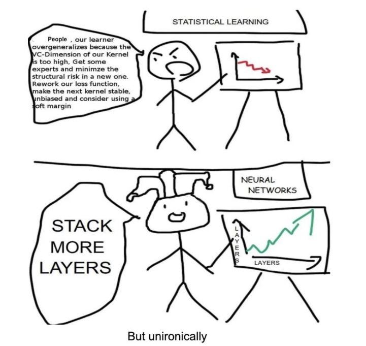

# **Large Language Models Resources Repository**

 

<b><i>"If God did not exist, it would be necessary to invent him." - Voltaire</i></b>
 
 
<b><i>"The real question is not whether machines think but whether men do." - B. F. Skinner</i></b>

 

  

## Motivation

This is a personal GitHub repository for **stashing resources on Large Language Models** (LLM), which will at the very least include the following:

- Curated list of the latest open source LLMs (Vanilla HuggingFace, GPTQ, GGML for llama.cpp)
- Code implementation of open source finetuned LLMs (e.g. Vicuna, OpenAssistant, WizardLM, etc.)
- LLMs Applications with Langchain (e.g. plugins, documment summarization, story writing, etc.)
- Analysis of finetuned datasets (e.g. ShareGPT, WizardLM, OpenAssistant, etc.)
- Survey of research literature on LLM

Resources on this repository are of free of use with no restrictions.

## Contents

- Research litterature on Large Language Models
- Non-exhaustive summary of proprietary and open source LLMs
- Colab Notebooks
- Youtube Resources

## Colab Notebooks

Some ideas of implementations or use-cases with open source LLMs:

- [x] Running GPTQ variants of open source LLMs with HuggingFace Transformers and Langchain
- [ ] Running GGML variants (llama.cpp) of open source LLMs with Langchain (required to run LLMs with more than 50B parameters)
- [ ] Use case: Using Anthropic's Constitutional AI to better moderate the outputs of unrestricted LLMs  
- [ ] Use case: Using Open Source LLMs with Langchain for Web Search (e.g. Wikipedia, DuckDuckGo)
- [ ] Use case: Using Open Source LLMs with Langchain for reading multiple PDF files
- [ ] Use case: Using Open Source LLMs with Langchain for story writing
- [ ] Example of AutoGPT using an open source LLM with Langchain and BabyAGI