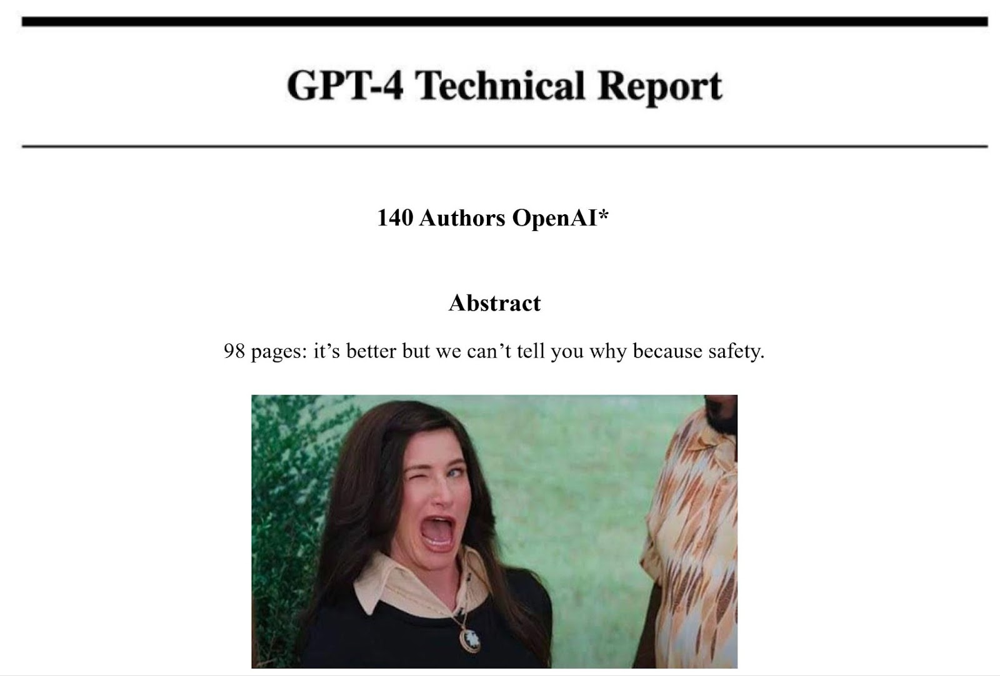

# **LLM: Research Papers**

 

  

<i>Come on OpenAI, release the GPT-4 weights</i> :innocent:

As Large Language Models (LLM) have exploded in popularity since the unveiling of ChatGPT by OpenAI in October 2022, research and commercial interest over LLMs has led to a tsunami of research contributions. This is an attempt to curate the list of research articles, with a description of the main findings of each paper to the best of my knowledge. This list is non-exhaustive.

## Summaries

- [Zhao, Wayne Xin et al. “**A Survey of Large Language Models**.” ArXiv abs/2303.18223 (April 2023)](https://www.semanticscholar.org/paper/A-Survey-of-Large-Language-Models-Zhao-Zhou/1d29334cfbe9a1a943082058876f0c22d44c62fd)
    - Great place to start. Setups a rigourous taxonomy for what constitutes an LLM: an NLP text generation transformer can be reasonably classified as an LLM when its parameter count hovers around 10B or more (for reference BERT only has 300 million parameters, LLaMA biggest model has 65 billion and GPT-3 has 175 billion).
- [Bowman, Sam. “**Eight Things to Know about Large Language Models**.” ArXiv abs/2304.00612 (April 2023)](https://www.semanticscholar.org/paper/Eight-Things-to-Know-about-Large-Language-Models-Bowman/23a183676b28269e7a427c41da7329b6326a9f17)
    - In one of his 8 points, Bowman scrutinizes the "emergent abilities" claim by Wei et al. [2022], that on previously "unsolvable" tasks once a certain large threshold of parameter count is reached, LLM unexpectedly performance jumps massively. The author finds that of the **202 tasks evaluated by Wei et al., only 33% of them are truly "emergent"**, i.e. see discontinuous jumps in performance. Most other tasks see continuous improvements, no improvements and a few see performance degradations.
- [Yang, Jingfeng et al. “**Harnessing the Power of LLMs in Practice: A Survey on ChatGPT and Beyond**.” ArXiv abs/2304.13712 (April 2023)](https://www.semanticscholar.org/paper/Harnessing-the-Power-of-LLMs-in-Practice%3A-A-Survey-Yang-Jin/131c6f328c11706de2c43cd16e0b7c5d5e610b6a)
    - Main takeaway of this paper is that while LLMs outperform classical state-of-the-art  transformers (BERT, RoBERTa, BART) on tasks that require out-of-sample generalization, on domain-specific tasks classical supervised methods still outperform LLMs (e.g. **English-Kazakh translation**).

## Foundational LLMs

- [Brown, Tom B. et al., “**Language Models are Few-Shot Learners**.” ArXiv abs/2005.14165 (May 2020)](https://www.semanticscholar.org/paper/Language-Models-are-Few-Shot-Learners-Brown-Mann/6b85b63579a916f705a8e10a49bd8d849d91b1fc)
    - **GPT-3** (175B parameters) by OpenAI which powers chatbot ChatGPT (free-tier version). Proprietary LLM.
- [Thoppilan, Romal et al. “**LaMDA: Language Models for Dialog Applications**.” ArXiv abs/2201.08239 (Jan. 2022)](https://www.semanticscholar.org/paper/LaMDA%3A-Language-Models-for-Dialog-Applications-Thoppilan-Freitas/b3848d32f7294ec708627897833c4097eb4d8778)
    - **LaMDA** (137B parameters) by Google which powered chatbot Bard (to be replaced soon by PaLM 2). Proprietary LLM.
- [Chowdhery, Aakanksha et al. “**PaLM: Scaling Language Modeling with Pathways**.” ArXiv abs/2204.02311 (April 2022)](https://www.semanticscholar.org/paper/PaLM%3A-Scaling-Language-Modeling-with-Pathways-Chowdhery-Narang/094ff971d6a8b8ff870946c9b3ce5aa173617bfb)
    - **PaLM 1** (540B parameters) by Google. Proprietary LLM.
- [Touvron, Hugo et al. “**LLaMA: Open and Efficient Foundation Language Models**.” ArXiv abs/2302.13971 (Fev. 2023)](https://www.semanticscholar.org/paper/LLaMA%3A-Open-and-Efficient-Foundation-Language-Touvron-Lavril/57e849d0de13ed5f91d086936296721d4ff75a75)
    - **LLaMA** (7B to 65B parameter variants) by Meta. Released to the public under a non-commercial licence. Now ubiquitous among the research and AI enthusiast community, seeing countless finetuned variants (e.g. Alpaca, Vicuna, Open Assistant, WizardLM, Manticore, etc.).
- [OpenAI. “**GPT-4 Technical Report**.” ArXiv abs/2303.08774 (March 2023)](https://www.semanticscholar.org/paper/GPT-4-Technical-Report-OpenAI/8ca62fdf4c276ea3052dc96dcfd8ee96ca425a48)
    - **GPT-4** (unknown parameter count) by OpenAI which powers chatbot ChatGPT and can be used with external plugins (premium version). Proprietary LLM.
- [Biderman, Stella Rose et al. “**Pythia: A Suite for Analyzing Large Language Models Across Training and Scaling**.” ArXiv abs/2304.01373 (April 2023)](https://www.semanticscholar.org/paper/Pythia%3A-A-Suite-for-Analyzing-Large-Language-Models-Biderman-Schoelkopf/64e20f2abc15d5cf04a682df5a1265bd45ba9fe7)
    - **Pythia** (3B, 7B, 12B) by EleutherAI (ex-OpenAI veterans). Open source with free commercial licence.
- [Anil, Rohan et al. “**PaLM 2 Technical Report**.” (May 2023)](https://www.semanticscholar.org/paper/PaLM-2-Technical-Report-Anil-Dai/eccee350691708972370b7a12c2a78ad3bddd159)
    - **PaLM 2** (340B parameters) by Google which is expected to replace LaMDA as the LLM powering chatbot Bard. Proprietary LLM. 
    - Note: the 340B figure was first reported by CNBC on May 16th 2023 ([Source](https://www.cnbc.com/2023/05/16/googles-palm-2-uses-nearly-five-times-more-text-data-than-predecessor.html))

## Alignment Fine-Tuning Methods (RLHF*)

*Reinforcement Learning with Human Feedback

- [Hu, J. Edward et al. “**LoRA: Low-Rank Adaptation of Large Language Models**.” ArXiv abs/2106.09685 (June 2021)](https://www.semanticscholar.org/paper/LoRA%3A-Low-Rank-Adaptation-of-Large-Language-Models-Hu-Shen/a8ca46b171467ceb2d7652fbfb67fe701ad86092)
- [Ouyang, Long et al. “**Training language models to follow instructions with human feedback**.” ArXiv abs/2203.02155 (March 2022)](https://www.semanticscholar.org/paper/Training-language-models-to-follow-instructions-Ouyang-Wu/d766bffc357127e0dc86dd69561d5aeb520d6f4c)
- [Wang, Yizhong et al. “**Self-Instruct: Aligning Language Model with Self Generated Instructions**.” ArXiv abs/2212.10560 (Dec. 2022)](https://www.semanticscholar.org/paper/Self-Instruct%3A-Aligning-Language-Model-with-Self-Wang-Kordi/bbe93c90b7b87939cd064c805858feca61a3234d)
- [Peng, Baolin et al. “**Instruction Tuning with GPT-4**.” ArXiv abs/2304.03277 (April 2023)](https://www.semanticscholar.org/paper/Instruction-Tuning-with-GPT-4-Peng-Li/9e8cb8c91a0acb6e661b58ad724aa758490f2bea)
- [Kopf, Andreas et al. “**OpenAssistant Conversations - Democratizing Large Language Model Alignment**.” ArXiv abs/2304.07327 (April 2023)](https://www.semanticscholar.org/paper/OpenAssistant-Conversations-Democratizing-Large-Kopf-Kilcher/cf991eb05067c19c3786418e2bb6681a818574f0)
- [Xu, Can et al. “**WizardLM: Empowering Large Language Models to Follow Complex Instructions**.” ArXiv abs/2304.12244 (April 2023)](https://www.semanticscholar.org/paper/WizardLM%3A-Empowering-Large-Language-Models-to-Xu-Sun/c61abec65d3b5d2bbd294b3d03f12ae252ed78a7)

## Theoretical Considerations on LLMs

- [Wei, Jason et al. “**Emergent Abilities of Large Language Models**.” Trans. Mach. Learn. Res. 2022 (June 2022)](https://www.semanticscholar.org/paper/Emergent-Abilities-of-Large-Language-Models-Wei-Tay/dac3a172b504f4e33c029655e9befb3386e5f63a)
- [Bubeck, Sébastien et al. “**Sparks of Artificial General Intelligence: Early experiments with GPT-4**.” ArXiv abs/2303.12712 (March 2023)](https://www.semanticscholar.org/paper/Sparks-of-Artificial-General-Intelligence%3A-Early-Bubeck-Chandrasekaran/574beee702be3856d60aa482ec725168fe64fc99)
- [Schaeffer, Rylan et al. “**Are Emergent Abilities of Large Language Models a Mirage?**” ArXiv abs/2304.15004 (April 2023)](https://www.semanticscholar.org/paper/Are-Emergent-Abilities-of-Large-Language-Models-a-Schaeffer-Miranda/27aeb0cdc2f09d9cd856d047ff61a91e85ba6794)

## Quantization of LLMs

- [Frantar, Elias et al. “**GPTQ: Accurate Post-Training Quantization for Generative Pre-trained Transformers**.” ArXiv abs/2210.17323. Published at the ICLR 2023 (Oct. 2022)](https://www.semanticscholar.org/paper/GPTQ%3A-Accurate-Post-Training-Quantization-for-Frantar-Ashkboos/7da0f2501034522e3d50af7e9b8fa7ec9d7b65b6)
- [Yao, Z. et al. “**A Comprehensive Study on Post-Training Quantization for Large Language Models**”. ArXiv, abs/2303.08302. (March 2023)](https://www.semanticscholar.org/paper/A-Comprehensive-Study-on-Post-Training-Quantization-Yao-Li/ab020d4bea061a0a09dfb3d58654fefb3d5ee770)

## Robustness
- [Wan, Alexander et al. “**Poisoning Language Models During Instruction Tuning**.” ArXiv abs/2305.00944 (May 2023)](https://www.semanticscholar.org/paper/Poisoning-Language-Models-During-Instruction-Tuning-Wan-Wallace/13e0f0bf9d6868d6825e13d8f9f25ee04285cd29)

## Alignment and Ethics (limitations of alignment)

- [Santurkar, Shibani et al. “**Whose Opinions Do Language Models Reflect?**” ArXiv abs/2303.17548 (March 2023)](https://www.semanticscholar.org/paper/Whose-Opinions-Do-Language-Models-Reflect-Santurkar-Durmus/e38a29f6463f38f43797b128673b9e44d18a991e)
- [Deshpande, A. et al. “**Toxicity in ChatGPT: Analyzing Persona-assigned Language Models**.” ArXiv abs/2304.05335 (April 2023)](https://www.semanticscholar.org/paper/Toxicity-in-ChatGPT%3A-Analyzing-Persona-assigned-Deshpande-Murahari/281a7a99c16ce8f53bfbfb7aeb460dbd28648d28)

## Alignment and Ethics (alternatives to RLHF)

- [Bai, Yuntao et al. “**Constitutional AI: Harmlessness from AI Feedback**.” ArXiv abs/2212.08073 (Dec. 2022)](https://www.semanticscholar.org/paper/Constitutional-AI%3A-Harmlessness-from-AI-Feedback-Bai-Kadavath/3936fd3c6187f606c6e4e2e20b196dbc41cc4654)
- [Sun, Zhiqing et al. “**Principle-Driven Self-Alignment of Language Models from Scratch with Minimal Human Supervision**.” ArXiv abs/2305.03047 (May 2023)](https://www.semanticscholar.org/paper/Principle-Driven-Self-Alignment-of-Language-Models-Sun-Shen/e01515c6138bc525f7aec30fc85f2adf028d4156)

## Economics

- [Eloundou, Tyna et al. “**GPTs are GPTs: An Early Look at the Labor Market Impact Potential of Large Language Models**.” ArXiv abs/2303.10130 (March 2023)](https://www.semanticscholar.org/paper/GPTs-are-GPTs%3A-An-Early-Look-at-the-Labor-Market-of-Eloundou-Manning/538ea3b1f942f27d0db6eaf6c16711bc505c2c9e)

